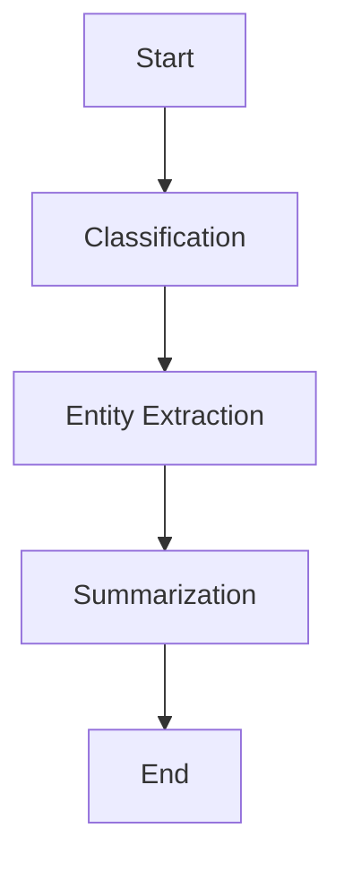

# LangGraph Ollama Text Analysis Agent

A Thai text analysis application built with LangGraph and Ollama that performs classification, entity extraction, and summarization using local language models.

## Features

- **Text Classification**: Categorizes text into news, blog, research, or other categories
- **Entity Extraction**: Identifies named entities (people, organizations, places)
- **Text Summarization**: Generates concise summaries
- **Interactive Web UI**: Built with Streamlit
- **Local LLM Support**: Uses Ollama for privacy and offline processing
- **Workflow Visualization**: Displays processing pipeline with Mermaid diagrams

## Prerequisites

- Python 3.8+
- Ollama installed and running
- Required Ollama models downloaded

## Installation

1. **Clone the repository**
   ```bash
   git clone <repository-url>
   ```

2. **Install dependencies**
   ```bash
   pip install streamlit langgraph langchain langchain-community langchain-ollama python-dotenv pillow
   ```

3. **Install and setup Ollama**
   - Download Ollama from [ollama.ai](https://ollama.ai)
   - Pull required models:
   ```bash
   ollama pull qwen2.5:7b
   ollama pull llama3:8b
   ollama pull codegemma:7b
   ollama pull llava:7b
   ```

4. **Create environment file** (optional)
   ```bash
   touch .env
   ```

## Usage

1. **Start the application**
   ```bash
   streamlit run langgraph_ollama_agent.py
   ```

2. **Access the web interface**
   - Open your browser to `http://localhost:8501`

3. **Analyze text**
   - Choose input method: sample text, custom text, or file upload
   - Select model and adjust temperature in sidebar
   - Click "Analyze Text" to process
   - View results in organized tabs
   - Download results as text file

## Workflow



## Supported Models

- `qwen2.5:7b` (default)
- `llama3:8b`
- `codegemma:7b`
- `llava:7b`

## Configuration

- **Temperature**: Controls randomness (0.0-1.0)
- **Model Selection**: Choose from available Ollama models
- **Input Methods**: Text area, file upload, or sample text

## File Structure

```
Agent_Langgraph_Learning/
├── langgraph_ollama_agent.py    # Main application
├── README.md                    # This file
└── .env                        # Environment variables (optional)
```

## Dependencies

- `streamlit`: Web interface
- `langgraph`: Workflow orchestration
- `langchain`: LLM framework
- `langchain-ollama`: Ollama integration
- `python-dotenv`: Environment management
- `pillow`: Image processing

## Troubleshooting

**Ollama not found**
- Ensure Ollama is installed and running
- Check if models are downloaded: `ollama list`

**Model loading errors**
- Verify model names match available models
- Try pulling models again: `ollama pull <model-name>`

**Memory issues**
- Use smaller models or reduce batch size
- Close other applications to free memory

## License

MIT License
